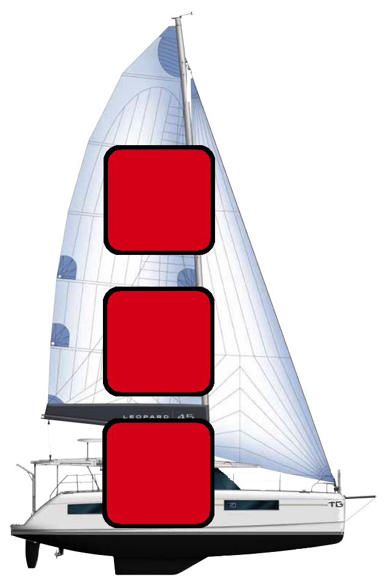
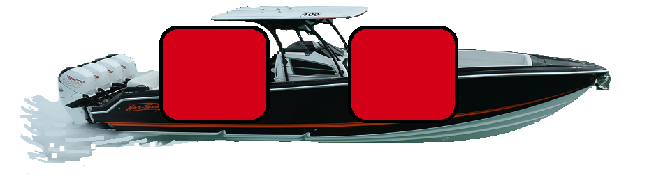
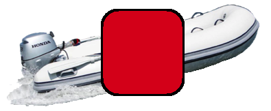
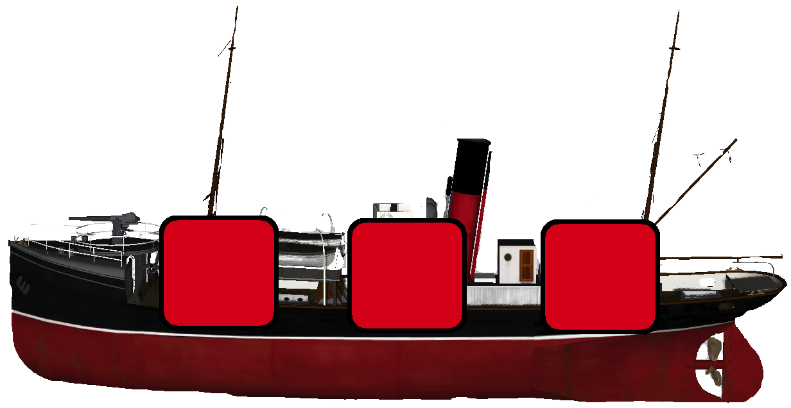
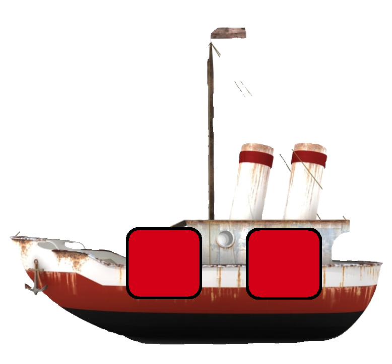
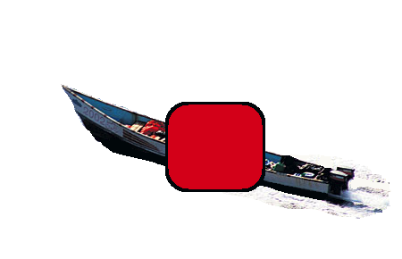

# savage_sailors

## Compliments of Tyler Goodman

### WDIR Project 1

## the set up...

Once upon a time, you fancy yourself a world traveler so you decided to grab up your favorite friends and family to strike out into the open sea. Leaving the harbor everything is just fine and dandy...

You’ve been sailing around the ocean for awhile now all peaches and smiles...when you stumble on an island of pirate misfits! And to top it off they’re all hopped up on radioactive coconut beer. They've loaded into their boats and are on their way to try to sink your boats and take all your stuff!

Now, you’re not just some broke joke of a sailor! You sail with a small armada of pleasure boats so you’re actually pretty well equipped to fend off their attack! You have a Catamaran, a center-console Fishing boat, and a Tender. Each boat can only take a certain amount of damage. If you’ve ever played a game that rhymes with cattle chip, you know how to play Savage Sailors!

## the how to...

Take turns with the Savages firing shots at each other. The Savages will shoot first; after all, you aren’t unprovoked in your hostilities here!

On your turn, click a square on the enemy’s board to shoot at. ‘Hit’ or ‘Miss’ will then be displayed. Trade shots with the Savages until all of their ships (or yours) are destroyed.

Keep track of the health of the ships in the Boats and Enemy Boats section. Enemy boats will only show red if they’re sunk. Whoever survives, lives to sail another day!

## userBoats

**Catamaran**

**Center Console**

**Dingy**

## enemyBoats

**Trawler**

**Ol Busted Steamer**

**Skiff**

